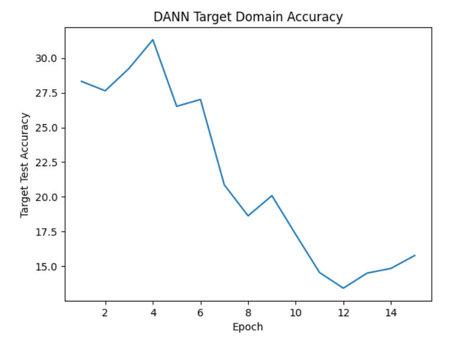
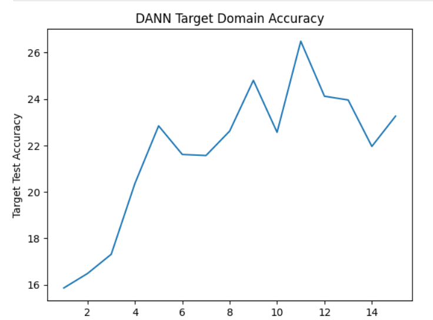
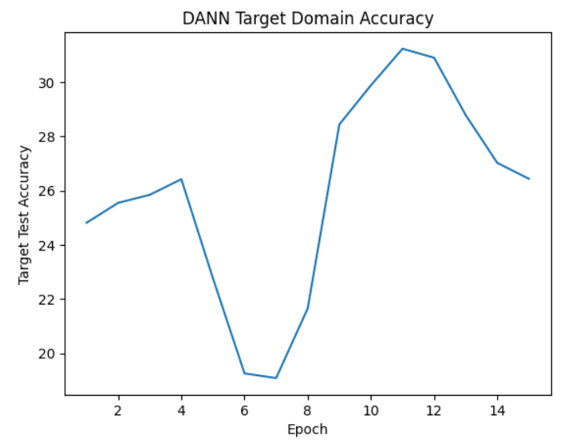
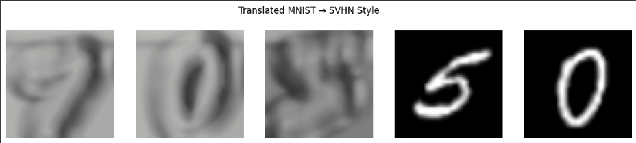

# Позже напишу вступлени

# baseline результаты (без domain adaptation)
Evaluation on MNIST (same domain):
Accuracy: 98.99%
98.99
Evaluation on SVHN (cross-domain):
Accuracy: 31.11%
31.107867240319607

# DANN
К сожалению DANN не улучшил результаты от слова совсем. Похоже на 
то, что когда результаты лучше - это засчёт чистой случайности. 

Вероятно, я что-то делаю не так. Может стоило бы 
перебрать гиперпараметров побольше, но я как ни старался не получилось сделать 
лучше, чем просто наивный подход без домэйн адаптейшна (возможно большее количество эпох показало бы результат 
лучше, я не уверен).

# CyCADA

Эх... несомтря на то, что [преобразования MNIST в SVHN](https://drive.google.com/drive/folders/1wg2WdWw88Bd65Z-xqt7MA3b5irscqnk8?usp=sharing) были впечатляющими, всё равно у меня 
не получается обучить нормально на них модельку и accuracy выходит 10%, то есть как при случайном выборе в целом :(

